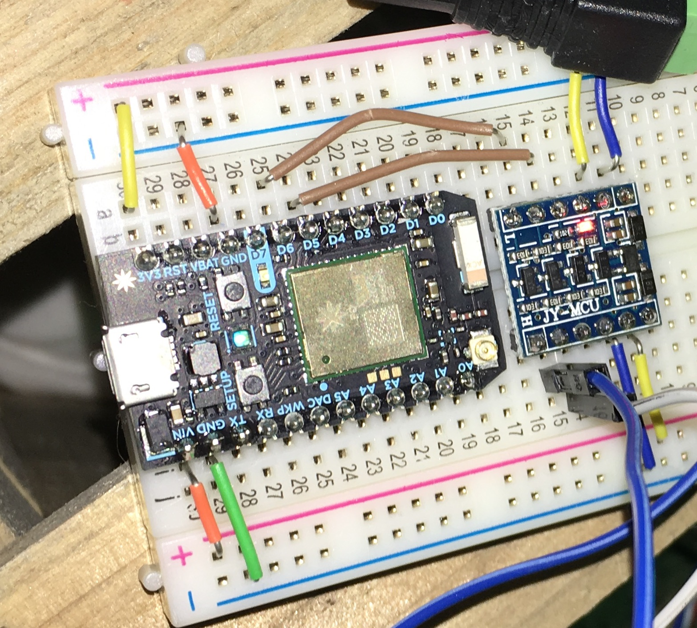

First and foremost, this post shouldn't be considered as a step-by-step how-to. While I will go over some pretty low-level details and post code here, this post just won't work well if followed in sequential steps. That being said, I do hope it helps answers some of your question you may initially have and if it doesn't, feel free to reach out!

Before we get started, here's the end result.

<YouTubeEmbed videoId="VGpFoQ65XL0" />

It started with one simple thought.

> “Oh, why buy lights? This will be a neat project. I'll get _at least_ a few hours of entertainment.”

Ha! Had I only known. Making the lights blink on the tree was the easy part. I could have stopped there, but since I already tell Siri to turn off every other light in my apartment each night, I felt like a filthy animal turning my Christmas tree off manually. I wanted Siri to take care of this for me. I wanted to just say, “Hey Siri, good-night”, and have everything just work. So here's how I did it.

## Software

#### Homebridge

Most likely due to my complete incompetence, this software is painful to set up. If there's one thing I'm thankful for is that there's no reason to ever re-invent the wheel these days. We are standing on the shoulders of giants! I was able to find an arm-based Docker image.

- [GitHub - nfarina/homebridge: HomeKit support for the impatient](https://github.com/nfarina/homebridge)

#### Docker

Docker will need to be installed on the Raspberry Pi. There's a guide on the official Raspberry Pi site that details how to do this. I don't have it handy right now, but a simple search should turn it up.

- [RPi Homebridge Docker Image](https://hub.docker.com/r/hugoch/rpi-python-homebridge/)

You'll also need recent version of iOS that has HomeKit.

## Hardware

#### The Micro-controller

I opted for the Particle Photon because it cuts out most of the setup needed for internet enabled projects. Particle offers a feature rich platform when using any of their products. The most impressive being a web IDE that lets you wirelessly update the firmware. Jaw, meet floor. It also offers a few extra goodies in it's API, but we'll get to those later. I couldn't be happier with the Photon. I own two, and they're my goto when I have a new project. I'm sure some people will have an issue with all of their code being on a platform they don't have full control over, but doesn't the S in IoT stands for Security? For small projects like this, I have no issue with it.

- [Particle Photon](https://www.particle.io/products/hardware/photon-wifi-dev-kit)

#### Raspberry Pi

Awhile back I snatched one of the Raspberry Pi Zeros on sale at [Pimoroni](https://shop.pimoroni.com/) and it had been sitting in my desk ever since. Seemed like the perfect candidate since the main purpose of the OS would be to run a lightweight Arm-based Docker image. Any Raspberry Pi will do. In fact, any OS will do, you'd just have to find a different way to get `HomeBridge` running.

- [RaspberryPi Zero](https://www.adafruit.com/products/2817)

#### Misc items

A logic level converter was needed since the lights required at least 5v to push them and the Photon only puts out 3.3v.

- [Logic Level Converter](https://www.adafruit.com/products/757)

Again, I had some led strips laying around from old projects. Once you start this hobby, it's a slippery slope. I used 2 WS2811 50-light led strips.

- [WS2811 LED](https://www.amazon.com/gp/product/B01AG923HC/ref=oh_aui_detailpage_o02_s00?ie=UTF8&psc=1)

For power, I'm using a 5v 2a power supply

- [Link](https://www.adafruit.com/products/276)

And, of course, the tree..


## Wiring

As mentioned, the Photon only outputs 3.3v, but it can powered from 5v which made my life so much easier. I'll briefly describe the picture below. The bottom gutter (the rows of + and -) is powered directly from the 5v power supply plugged into the wall. The Photon is brought to life by providing power through the `vin` and `gnd` pins. On the other side, we have the 3.3v out. That and the other `gnd` pin are powering the other power gutter with 3.3v and grounding. Pins `D5` and `D6` are going into two of channels of the logic level converter which helpfully converts those 3.3v power and signals to 5v and sends those instructions directly to the led strip.



## Code

I began searching for lighting libraries and found [FastLED](https://github.com/FastLED/FastLED). I was quickly sold because not only did it do exactly what I wanted right out of the box, but it came with a handy demo-reel function that was perfect for my needs. At this point, I just had to plug in the power and the particle would light up my tree.

Remember what I said earlier about Particle providing their own platform? The code you write is still `C++` and very similar to developing with an Arduino. Particle adds a few things into the “standard library” for you to take advantage of. For example, you have the ability to expose variables and functions. This lets you see the values of the published variables through their online console, and lets you call those functions through an api with a provided secret key. My head exploded with the possibilities. I could only think of trivial examples, but just knowing I had that capability felt astounding.

To publish a function using Particle, you'd have something similar to this in your `.ino` file.

```cpp
int lightsOn(String input);
int lightsOff(String input);

void setup() {
  // Publishing particle functions and vars.
  Particle.function("lightsOn", lightsOn);
  Particle.function("lightsOff", lightsOff);
}

void loop() {
  // ...stuff
}

int lightsOn(String input) {
  // ..turn lights on
}

int lightsOff(String input) {
  // ..turn lights off
}
```

<PhotoGrid images={["particleapp2.jpg", "tree_with_lights.jpg"]} />

The last feature of Particle that I took advantage of was the ability to publish events. These events could be anything you wanted since you control the content and when they're dispatched in your code. The strength lies in the ability to use them with web-hooks or, perhaps more exciting, IFTTT. This meant that I could make my Christmas tree tweet.

So I created a few messages for when the tree turns on or off and would pick one at random when fired and publish the event for IFTTT to pick up and take care of. No twitter api code to write. Again, no need to reinvent the wheel. The only stipulation was that the events had to be unique otherwise, IFTTT would ignore them. I solved this by just throwing a date time in the message. For example, if you wanted to send a tweet every 10 seconds it would look something like this.

```cpp
int tweet(String msg);
String onMessages[] = {
  "Lighting it up for Christmas!",
  "Let's get LIT!"
};

void setup() {
  Particle.function("tweet", tweet);
}

void loop() {
  int size = sizeof(onMessages) / sizeof(onMessages[0]);
  String msg = onMessages[random(0, size)];
  tweet(msg);
  delay(10 * 1000);  // wait 10 seconds
}

// Per the docs, published particle functions
// must take a String as a parameter and return
// an int as a status code of 1 or 0.
int tweet(String msg) {
  Particle.publish("sendTweet", msg, 60, PRIVATE);
  return 0;
}
```

<PhotoGrid images={["particleapp1.jpg", "twitter.jpg"]} />

## Siri

I no longer had to deal with the excruciatingly inconvenient task of plugging and unplugging my tree. It was a bit easier that it was now controlled through firing the functions in the Particle app, but that meant that sole responsibility for that fell on me and me only. It was time to let Siri take over this task. That would mean that anyone in my household could tell her to turn my tree on or off regardless if _they_ were home or not. That's right. We would be able to control our tree wherever we were, in the WORLD!

Once I found this [docker image](https://hub.docker.com/r/hugoch/rpi-python-homebridge/), everything sort of fell into place. I created an extremely simple Dockerfile that would also install the [homebridge-particle](https://github.com/krvarma/homebridge-particle) add-on.

Before you can run this you'll need to have a file named `config.json` exposed to the Docker image. This file tells Homebridge what you have that you're wanting to expose to Apple's HomeKit. Here's what my config looked like.

```json
{
  "bridge": {
    "name": "HomebridgePI",
    "username": "CC:22:3D:E3:CE:31",
    "port": 51826,
    "pin": "031-45-154"
  },

  "description": "",
  "platforms": [
    {
      "platform": "Particle",
      "name": "Particle Devices",
      "access_token": "<YOUR_TOKEN>",
      "cloudurl": "https://api.particle.io/v1/devices/",
      "devices": [
        {
          "accessory": "Christmas Tress",
          "name": "Christmas Tree",
          "deviceid": "station_ferret",
          "type": "LIGHT",
          "function_name": "toggleLights",
          "args": "0={STATE}"
        }
      ]
    }
  ]
}
```

Run the image with a command like this:

```sh
$ docker run -itd —net host -p 0.0.0.0:51826:51826 -v /path/to/homebridge/config/folder/:/root/.homebridge hugoch/rpi-python-homebridge:v1 /root/run_homebridge.sh`
```

After that open up HomeKit on your iOS device and you should see the new “Homebridge” accessory listed. You can add it into any scene, or just use Siri to access it directly by name.

## Fin

Here's the github repo with the code I used: [xmas-tree](https://github.com/WTFox/xmas-tree).

Again this guide wasn't really meant to be a step by step guide but more of a high level guide. Feel free to reach out if you have any questions!
