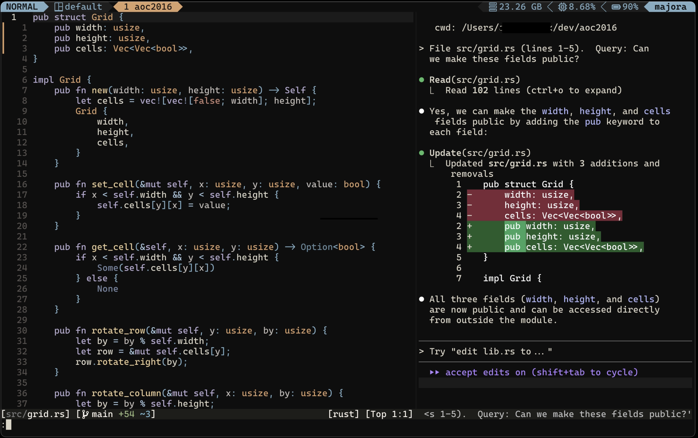

I've been using Claude Code CLI pretty heavily lately, and while it's fantastic, I found myself constantly switching between my editor and terminal to share context with Claude. So I built a little Neovim plugin that bridges that gap.

[claude-chat.nvim](https://github.com/wtfox/claude-chat.nvim) wraps the Claude Code CLI and automatically shares your current file context, selections, and custom prompts. Hit `<leader>cc`, type your question, and Claude gets your file path and any selected code without you having to manually copy-paste anything. It opens Claude in a split window right inside Neovim, so you can chat while keeping your code visible. The plugin is smart about context too—if you have text selected, it sends that along with your prompt; if not, it just sends the current file context.

It's nothing revolutionary, just a simple wrapper that makes the Claude Code experience a bit smoother when you're deep in a coding session. Built mostly with Claude itself, which felt appropriately meta. Pull requests welcome if you want to help make it better!

