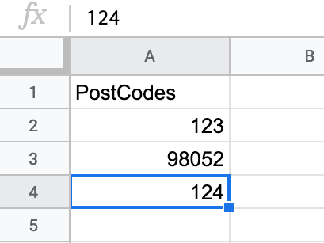
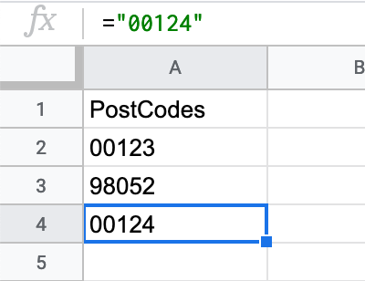

## Client experience is everything

At `$JOB`, we have this url that, when navigated to, builds a report and serves it to the user in a .xlsx format. This report is built inside of the request/reponse cycle and a pretty hefty query is needed to gather the data. So the request comes in, we run the query, arrange the data, and then package it up in an Excel file and send it in the response.

It's not hard to see why this could present scalability problems but it's also easy to fall into the trap of premature optimization. One of my first thoughts was to utilize a worker process to build and cache report data when the underlying data was changed. We all need someone there to remind us that we're not operating at Google scale. Nor do we need to.

Our stack is Python/Django/AWS. Django offers a Response class named `StreamingHTTPResponse`. As the docs warn, Django is designed for short-lived requests so the programmer should use caution as it could cause performance issues if you're not careful. [However, it's a great solution for streaming CSV file contents.](https://docs.djangoproject.com/en/3.0/howto/outputting-csv/#streaming-csv-files)

The Excel format is a packaged file type. Meaning it has necessary bits at the beginning and end of it's byte content that make sense to Excel. Unfortunately, the library we're using to write these workbooks don't allow for that content to be streamed. CSV files are plain text. You can open a plain text file and append as many rows as you want and the file will be valid if you just left it at that.

## Everything in software development is a trade off

Spreadsheet applications try to help you out. If a column has all numbers, Excel will convert that data type to a numeric for you. So if you have a CSV file that looks like this:

```text
PostCodes,
00123,
98052,
00124,
```

Excel will import it, see the numbers, and convert the column. You'll end up with something like this:



So on one hand we had solved our time restraint by streaming a text file instead of packaging up an Excel file. Yay. But on the other hand, our clients would get data they weren't expecting. [Of course there are ways to tell Excel how to correctly handle this.](https://support.office.com/en-us/article/keeping-leading-zeros-and-large-numbers-1bf7b935-36e1-4985-842f-5dfa51f85fe7) But if we know that our clients are going to open these files in Excel immediately, we can do better.

## TL;DR

```python
def format_numeric_for_workbook(val):
    """ Given a numeric value, return the special incantations needed to prevent Excel,
    Numbers, or Google Sheets from dropping leading zeros.
    """
    if not val:
        return ""
    return f'="{val}"'
```

This function formats the value into the spreadsheet function needed so that it renders correctly. This works in Numbers, Google Sheets, and Excel! If we're using this function to format our postal codes above, it would look like this in a standard text editor:

```text
PostCodes,
="00123",
="98052",
="00124",
```

But in Excel,


